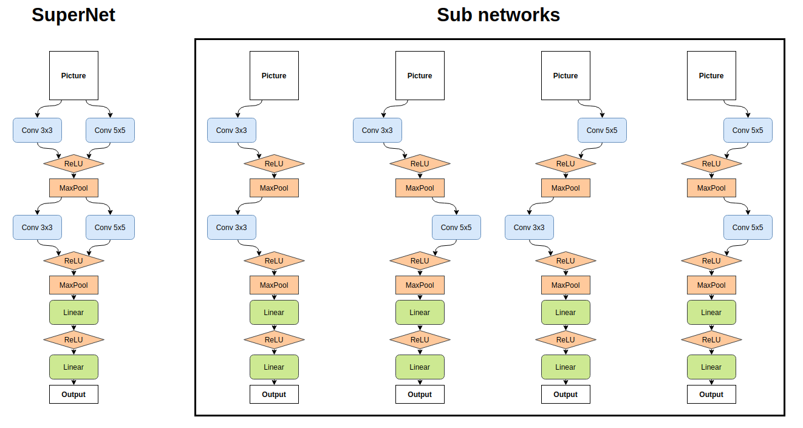

### SuperNet
Test Task @ [MIL](https://github.com/machine-intelligence-laboratory/MILTestTasks/tree/task/NAS-ImageNet)

1. **Related work**: [Understanding and Simplifying One-Shot Architecture Search.](http://proceedings.mlr.press/v80/bender18a/bender18a.pdf)

2. **Network Description**:
  

4. **How to reproduce**:
    
    You should specify corresponding `yml` file from `configs` folder for your experiment 
    
    If you have any troubles with config file, you could look into `configs/train_super_net.yml`. It has comments to help you.
    
    0. Satisfy `requirements.txt`
    1. Training
        1. To train super net from scratch: `python3 super_net/train_super_net.py -c configs/train_super_net.yml`
        2. To train specific sub network from scratch: `python3 super_net/train_sub_net.py -c configs/<choose your config here>`
    2. Evaluation
        1. Evaluate super net `python3 super_net/validate_sampled_nets.py -c configs/train_super_net.yml`
        2. Evaluate sub nets `python3 super_net/validate_sub_nets.py -c configs/<choose your config here> -p configs/model_paths.yml`
        **Note** if you changed model path in `configs/<choose your config here>` you should change corresponding model path in `configs/model_paths.yml`
    3. You can look at `run_all.sh`. It is an example script for running the whole process: every training and every validation.

5. **Results**
    
    Networks named next way: first half is for convolution, which is used in first block,
    second half is for convolution, which is used in second block
    1. Sub networks were trained using sampling method

    |model name|test loss (cross-entropy)|test accuracy|
    |---|---|---|
    |conv3x3_conv3x3|0.0002|0.9838|
    |conv3x3_conv5x5|0.00019|0.9841|
    |conv5x5_conv3x3|0.00019|0.9848|
    |conv5x5_conv5x5|0.00018|0.9861|

    2. Each sub network was trained from scratch

    |model name|test loss (cross-entropy)|test accuracy|
    |---|---|---|
    |conv3x3_conv3x3|0.00015|0.9865|
    |conv3x3_conv5x5|0.001|0.8923|
    |conv5x5_conv3x3|0.001|0.892|
    |conv5x5_conv5x5|0.00014|**0.9886**|
    
    Despite the fact, that the best accuracy score has the model trained from scratch (`conv5x5_conv5x5`)
    SuperNet approach gives us more relatively good models in almost the same time.
